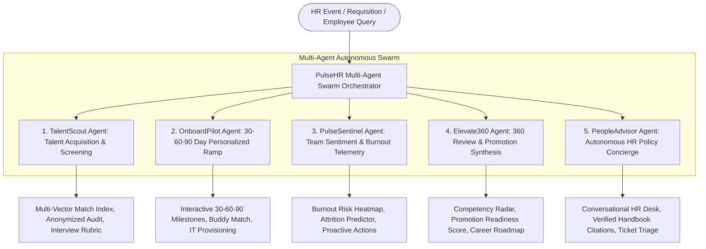

# PulseHR OS — Autonomous Multi-Agent Human Capital Management & Talent Lifecycle Platform

[](https://github.com)
[](https://cloud.google.com/vertex-ai)
[](https://www.typescriptlang.org/)
[](https://reactjs.org/)
[](https://vitejs.dev/)

> **Problem Statement Alignment**: *Streamline human capital management, talent acquisition, and workplace productivity. Develop AI agents that solve organizational, recruitment, or employee lifecycle challenges.*

---

## 📌 Executive Summary

Modern People Operations (HR) teams struggle with fragmented software silos, manual resume screening bottlenecks, subjective performance evaluations, protracted onboarding ramp cycles, and opaque team burnout.

**PulseHR OS** is an end-to-end, multi-agent AI orchestration platform powered by **Google Gemini (Vertex AI)**. It unites 5 specialized autonomous agents across the entire employee lifecycle:
1. **Talent Acquisition & Bias-Mitigated Screening** (Candidate scoring & interview rubric synthesis)
2. **Personalized 30-60-90 Day Onboarding** (Ramp-up milestones, mentor matching & IT provisioning)
3. **Workplace Productivity & Burnout Telemetry** (eNPS, meeting load, flight risk & managerial playbooks)
4. **Continuous 360-Degree Performance Appraisal** (Multi-stakeholder feedback & promotion readiness)
5. **Autonomous HR Policy Concierge** (Multi-turn conversational assistant with verified handbook citations)

---

## 🏛️ System Architecture

PulseHR OS coordinates a synchronized 5-agent swarm where each agent is responsible for an autonomous lifecycle phase, exchanging telemetry and structured context across an orchestrated pipeline.



---

## 🤖 The 5 Autonomous HR Agents

| Agent | Domain & Mission | Core Autonomous Deliverables |
| :--- | :--- | :--- |
| **🎯 TalentScout** | **Recruitment & Screening** | Multi-Vector semantic matching (Technical, Leadership, Culture, Retention), blind algorithmic DEI audit, auto-generated structured interview rubrics, and interactive candidate sandbox. |
| **🚀 OnboardPilot** | **Employee Lifecycle & Ramp** | Automated 30-60-90 day personalized milestone roadmap, interactive task checklists with velocity tracking, AI-matched onboarding buddy, and IT provisioning telemetry. |
| **📊 PulseSentinel** | **Productivity & Sentiment** | Real-time burnout risk gauge, eNPS metrics, meeting load fatigue tracking, 5-week sentiment trend bars, and 1-click proactive managerial interventions. |
| **📈 Elevate360** | **Performance & Growth** | Multi-stakeholder review synthesis, 5-dimension competency radar, objective Promotion Readiness Index, and quarterly career development pathways. |
| **💬 PeopleAdvisor** | **Autonomous HR Concierge** | Multi-turn conversational employee assistance grounded in company policies with verifiable handbook citations and contextual prompt suggestions. |

---

## 📂 Project Structure

```
HR-Automation-Agents/
├── index.html                   # HTML5 entry with fonts and metadata
├── package.json                 # React 18, Vite 6, TypeScript 5, Tailwind CSS, Lucide
├── vite.config.ts               # Vite configuration with React plugin
├── tailwind.config.js           # Custom design system tokens & glassmorphism theme
├── tsconfig.json                # Strict TypeScript configuration
├── src/
│   ├── main.tsx                 # React application bootstrapper
│   ├── App.tsx                  # Master dashboard with telemetry, swarm timeline & tab routing
│   ├── index.css                # Glassmorphic utilities, animations & custom dark scrollbars
│   ├── types/
│   │   └── hr.ts                # TypeScript interfaces for candidates, onboarding, pulse & reviews
│   ├── data/
│   │   └── enterprisePresets.ts # 4 rich pre-computed scenarios across tech, sales, design, & ops
│   ├── services/
│   │   └── geminiService.ts     # Google Gemini (Vertex AI) REST client with model selection
│   ├── components/
│   │   ├── Navbar.tsx           # Navigation bar with role preset switcher & Gemini config
│   │   ├── MetricOverview.tsx   # 4 high-level HR telemetry cards with real-time benchmarks
│   │   ├── AgentPipelineVisualizer.tsx # Live interactive multi-agent orchestration timeline
│   │   ├── ApiKeyModal.tsx      # Gemini API key and model selection modal
│   │   └── tabs/
│   │       ├── TalentScoutTab.tsx   # Candidate scoring, multi-vector radar & interview rubrics
│   │       ├── OnboardPilotTab.tsx  # Interactive 30-60-90 roadmap, task toggles & buddy card
│   │       ├── PulseSentinelTab.tsx # Department burnout index, sentiment trends & playbooks
│   │       ├── Elevate360Tab.tsx    # 360 feedback synthesizer, competency radar & export
│   │       └── PeopleAdvisorTab.tsx # Interactive conversational policy bot with citations
└── README.md                    # Comprehensive documentation & setup guide
```

---

## 💼 Enterprise Role Presets (Demo Ready)

PulseHR OS includes 4 complete enterprise scenarios ready for instant demonstration:

1. **Senior AI / ML Platform Engineer** (*Core Infrastructure & AI Platform*): LLM inference cluster scaling, high-throughput model gateways, GPU kernel page triage, and Staff-to-Principal progression.
2. **Enterprise Account Executive (GTM)** (*Revenue Operations & Enterprise Sales*): Multi-million dollar quota attainment, MEDDPICC qualification, sales ramp milestones, and quarter-end burnout mitigation.
3. **Lead Product Designer** (*Product Experience & Design*): Figma design system architecture, WCAG AAA accessibility, user research synthesis, and cross-functional engineering handoffs.
4. **Customer Success Operations Lead** (*Customer Experience & Solutions*): Net Revenue Retention (NRR) optimization, Gainsight health score automation, churn deflection, and support tiering.

---

## ⚡ Dual-Engine Architecture

- **Offline High-Fidelity Demo Mode**: Zero-latency, highly detailed datasets pre-configured for instant presentation and reliable offline demonstration.
- **Google Gemini Live Mode**: Configurable directly in the UI via the topbar **API Key** button. Enter any Google AI Studio or Vertex AI Gemini key (`gemini-2.5-flash`, `gemini-1.5-pro`, `gemini-1.5-flash`) to enable live dynamic candidate parsing, policy chat, and rubric generation.

---

## 🛠️ Technology Stack

- **Frontend & Runtime**: React 18, TypeScript 5, Vite 6
- **Styling & Aesthetics**: Tailwind CSS with custom glassmorphism design system (`#090d16` canvas, neon indigo/cyan/emerald accents, glowing borders, custom dark scrollbars)
- **Icons**: Lucide React
- **AI Integration**: Google Gemini REST API (Vertex AI compatible)

---

## 🚀 Quickstart Guide

### Prerequisites
- Node.js (v18+ or v20+)
- npm (v9+)

### Installation & Local Run

```bash
# 1. Clone or navigate to repository
cd HR-Automation-Agents

# 2. Install dependencies
npm install

# 3. Start local development server
npm run dev
```

The platform will launch at `http://localhost:5173`.

### Production Build Verification

```bash
npm run build
```

Compiles TypeScript cleanly and bundles production assets into `dist/`.

---

## 📄 License & Copyright

**Copyright (c) 2026 Ujjwal Kumar Bhowmick**  
- **Developer**: Ujjwal Kumar Bhowmick  
- **Email**: [ujjwalkumarbhowmick30@gmail.com](mailto:ujjwalkumarbhowmick30@gmail.com)  
- **All rights reserved.**

---

Developed for the **BITSom Vertex Fest** Hackathon. Powered by Google Gemini.
