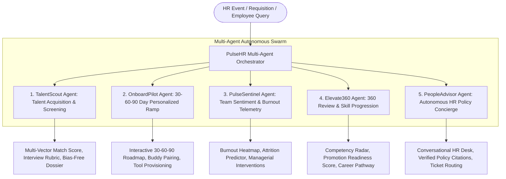

# PulseHR OS — Autonomous Multi-Agent Human Capital Management & Talent Lifecycle Platform

## Executive Summary & Problem Analysis

Based on the [README.md](file:///c:/Users/Administration/Desktop/VibeCoding/BITSom%20Vertex%20Fest/HR-Automation-Agents/README.md):
> *"Streamline human capital management, talent acquisition, and workplace productivity. Develop AI agents that solve organizational, recruitment, or employee lifecycle challenges."*

### Key Organizational, Recruitment & Lifecycle Pain Points
1. **Talent Acquisition Friction & Screening Bias**: Recruiters spend up to 70% of their time manually sifting through resumes and scheduling initial screens. Traditional keyword filtering rejects qualified non-traditional candidates while missing domain-specific skills, and interviews often suffer from unstandardized questioning and cognitive bias.
2. **Disjointed Employee Onboarding (High First-90-Day Churn)**: Up to 20% of employee turnover happens within the first 45 days. Static checklist onboarding fails to provide role-specific ramp-up milestones, personalized mentor pairing, and continuous feedback loops.
3. **Workplace Burnout & Opaque Team Sentiment**: HR teams usually identify employee dissatisfaction, burnout, and attrition risks through annual or quarterly surveys—often too late to retain top talent. Real-time telemetry on workload, meeting fatigue, and eNPS sentiment is urgently needed.
4. **Biased & Time-Consuming Performance Reviews**: 360-degree reviews are notoriously cumbersome, prone to recency bias, and rarely translate into concrete skills development plans or objective promotion criteria.
5. **Overwhelmed HR Support Desk**: Employees wait days for basic answers regarding parental leave, healthcare tiers, equity schedules, and compliance policies, burdening HR teams with repetitive queries.

---

## The Proposed Solution: **PulseHR OS**

**PulseHR OS** is an enterprise-grade, multi-agent AI orchestration platform powered by **Google Gemini (Vertex AI)**. It unites 5 specialized autonomous agents across the entire talent lifecycle into a cohesive, glassmorphism dashboard:



### The 5 Autonomous HR Agents:
1. 🎯 **TalentScout Agent** (*Recruitment & Intelligent Screening*):
   - Multi-vector semantic resume parsing against role requirements (Technical capability, Cultural contribution, Leadership traits, Growth trajectory).
   - Generates anti-bias interview guides with competency questions and objective scoring rubrics.
2. 🚀 **OnboardPilot Agent** (*Employee Lifecycle & Onboarding*):
   - Autonomous generation of personalized 30-60-90 day milestone plans tailored to seniority and technical domain.
   - Dynamic mentor/buddy matching, IT access checklist, and week-by-week success criteria.
3. 📊 **PulseSentinel Agent** (*Workplace Productivity & Sentiment Intelligence*):
   - Live organizational sentiment tracking, meeting load index, eNPS metrics, and attrition flight-risk detection.
   - Generates actionable proactive managerial intervention playbooks before burnout occurs.
4. 📈 **Elevate360 Agent** (*Performance Appraisal & Career Development*):
   - Synthesizes peer, direct-report, and manager feedback into objective performance reviews.
   - Computes Promotion Readiness Index, identifies skill gaps, and suggests tailored micro-learning pathways.
5. 💬 **PeopleAdvisor Agent** (*Autonomous HR Policy Concierge*):
   - RAG-powered interactive conversational assistant grounded in company handbooks, healthcare options, PTO policies, and parental leave guidelines.
   - Handles multi-turn inquiries with cited policy references and escalates edge cases to human HR leaders.

---

## User Review Required

> [!IMPORTANT]
> **Tech Stack Selection**:
> - **Frontend & Visualization**: React 18 + Vite + TypeScript + Tailwind CSS + Lucide Icons.
> - **Aesthetics**: Dark-mode glassmorphic theme (`#090d16`), glowing neon accent badges (indigo, emerald, cyan, amber, rose), micro-animations, radar charts, and interactive candidate filters.
> - **Dual Execution Modes**:
>   1. **Instant Interactive Demo Mode**: 4 rich enterprise scenarios (AI Platform Engineer, GTM Account Executive, Product Design Lead, Customer Success Specialist) with zero-latency response for demo presentations.
>   2. **Live Gemini API Mode**: Real-time integration with Google Gemini (gemini-1.5-pro / gemini-2.5-flash) via customizable API key in settings for custom role evaluations, resume uploads, and dynamic conversational HR inquiries.

---

## Proposed Project Structure & Components

```
HR-Automation-Agents/
├── index.html                   # Entry point with Google Fonts (Inter, JetBrains Mono)
├── package.json                 # React 18, Vite, TypeScript, TailwindCSS, Lucide-react
├── vite.config.ts               # Vite bundler config
├── tailwind.config.js           # Custom design tokens, glassmorphism, glowing borders
├── tsconfig.json                # Strict TypeScript configuration
├── src/
│   ├── main.tsx                 # React application bootstrapper
│   ├── App.tsx                  # Master dashboard with topbar, metrics, tabs & drawer
│   ├── index.css                # Custom CSS tokens, glass styling, animation keyframes
│   ├── types/
│   │   └── hr.ts                # TypeScript definitions for Candidates, Onboarding, Pulse, Reviews, Policy
│   ├── data/
│   │   └── enterprisePresets.ts # 4 rich pre-computed scenarios across tech, sales, design, & operations
│   ├── services/
│   │   └── geminiService.ts     # Direct Google Gemini Vertex AI client for live generation
│   ├── components/
│   │   ├── Navbar.tsx           # Brand header, model selector, API key button, live status
│   │   ├── MetricOverview.tsx   # Key metrics (Talent Pipeline, Avg Onboard Velocity, Org Health Score, Review Cycle)
│   │   ├── AgentPipelineVisualizer.tsx # Live interactive multi-agent orchestration timeline
│   │   ├── ApiKeyModal.tsx      # Gemini API key setup and model switcher modal
│   │   └── tabs/
│   │       ├── TalentScoutTab.tsx   # Resume scoring, multi-vector radar, interview rubric generator
│   │       ├── OnboardPilotTab.tsx  # 30-60-90 roadmap, interactive checklist, buddy card
│   │       ├── PulseSentinelTab.tsx # Team burnout heatmaps, attrition risk radar, managerial actions
│   │       ├── Elevate360Tab.tsx    # 360 feedback synthesizer, competency radar, promotion readiness
│   │       └── PeopleAdvisorTab.tsx # Interactive conversational HR policy bot with handbook citations
└── README.md                    # Comprehensive documentation update with architecture & usage
```

---

## Verification Plan

### Automated Verification
- `npm run build`: Verify 100% clean TypeScript compilation and Vite production bundle generation without any errors or warnings.

### Manual / Visual Verification
1. **Multi-Agent Pipeline Run**: Switch between presets or input custom requirements and watch the 5 agents activate sequentially with status indicators, token latency, and live execution telemetry.
2. **TalentScout Tab**: Test resume candidate selection, observe candidate ranking, multi-vector breakdown, and interview guide generation.
3. **OnboardPilot Tab**: Verify interactive 30-60-90 milestone checklist, task completions, and onboarding buddy information.
4. **PulseSentinel Tab**: Inspect the department burnout risk index, sentiment trends, and test triggering automated managerial interventions.
5. **Elevate360 Tab**: Verify 360 review synthesis, promotion readiness gauge, and personalized development recommendations.
6. **PeopleAdvisor Tab**: Chat with the HR concierge bot asking about parental leave, remote work stipends, or insurance, and verify cited handbook responses.
7. **Gemini Live Key Integration**: Open settings, toggle API key, and test dynamic generation with Gemini.
8. **README.md Update**: Update `README.md` to reflect the comprehensive solution architecture, features, workflows, and running instructions.
